# 小羊画师：一款基于ComfyUI的AI绘画APP

> 本项目是作者在学习ComfyUI时的一个实践项目。本项目的主要内容是使用ComfyUI搭建不同风格的文生图、图生图工作流，使用ComfyUI的API，在Unity中搭建一个可以互动的AI绘画APP前端模型。
>
> 注：因为作者才刚刚接触ComfyUI，所以使用的工作流是从网络上各位大佬的工作流上修改而来，我会在本文档中附上原工作流的地址，供大家参考。

### 更新说明：

**2024/12/22更新**

新增ComfyUI工作流说明

### 1.项目文件说明

### 2.ComfyUI工作流说明

在正式搭建AI绘画APP所使用的工作流前，我先学习了几个官方示例的工作流和网络上大佬分享的工作流

#### 2.1基本的文生图工作流

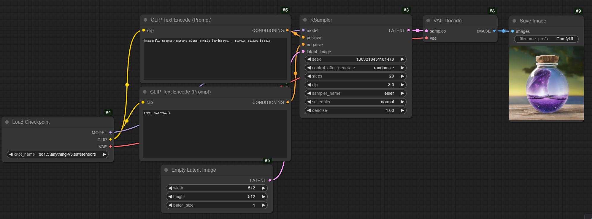

与WebUI不同的是，ComfyUI使用由一个个单一功能的节点组成的工作流来完成AI画图的工作，下面是这个基本的文生图工作流的节点和作用简述：

- Load Checkpoint: 向ComfyUI加载Checkpoint大模型
- CLIP Text Encode: 书写提示词，利用模型内置的CLIP来解读提示词，并将其转化为“条件”（Conditioning）输送到后续的节点
- KSampler: 它负责整个AI生成图片中最重要的一个环节：采样去噪
- Empty Latent Image：空白潜空间图像节点，可以用来控制生成图片的大小和批次大小（即一次生成多少张图片）
- VAE(变分自解码器) Decode： 将潜空间数据转化为一般的图像数据
- Save Image: 接受图像数据并保存为图片

#### 2.2基本的图生图工作流

在上面的文生图工作流上进行一些小的改动，就可以将其转换为图生图工作流

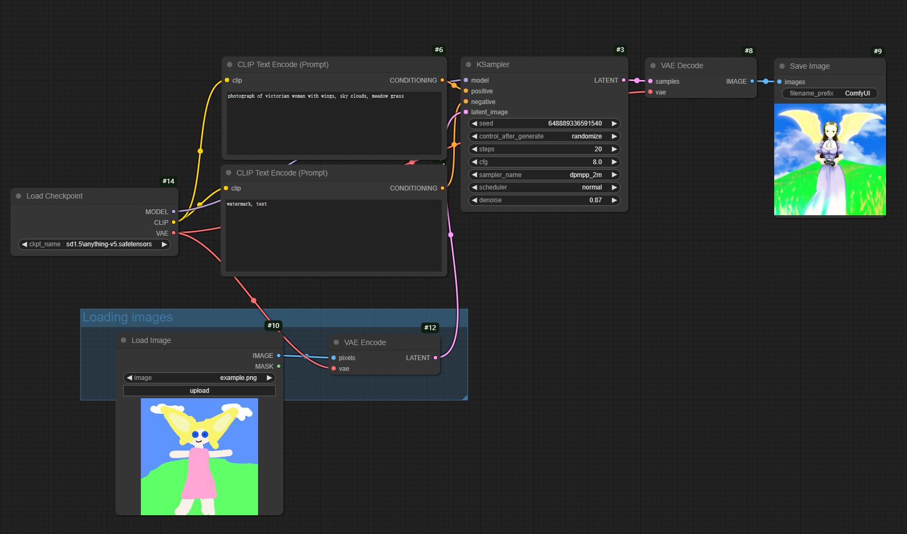

我们需要先删掉Empty Latent Image节点，再新增用来加载用户上传图像的`Load images`节点和将图像数据转化为潜空间数据（LATENT）的`VAE Encode`节点

#### 2.3高清修复工作流

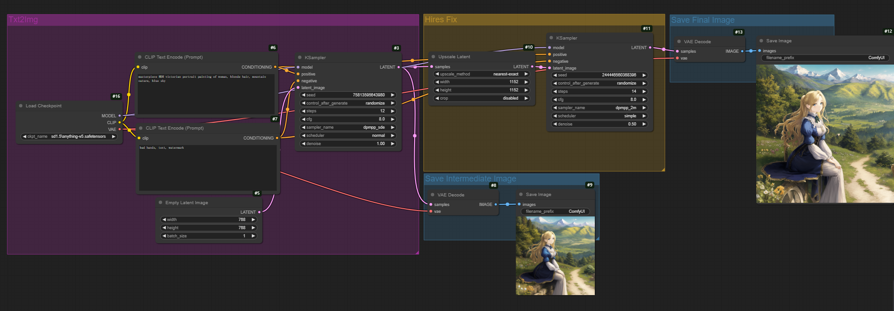

这个高清修复工作流示例的前半部分和基本的文生图工作流完全相同

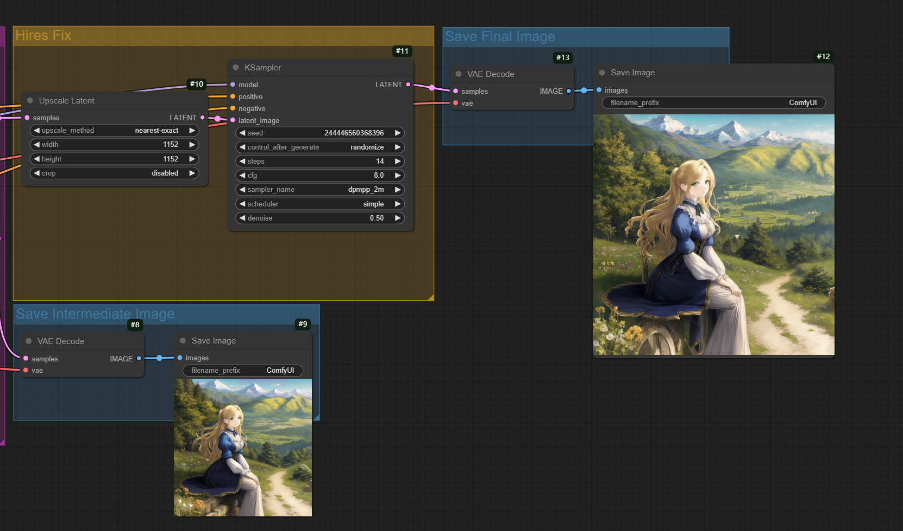

后半部分将文生图工作流中KSampler采样去噪之后的潜空间数据再传给VAE(变分自解码器) Decode并立刻保存的同时，又传给了`Upscale Latent`节点使用高清修复算法进行加工，将`Upscale Latent`节点加工后的潜空间数据传给第二个KSampler进行图片放大重绘，最后转换为图像数据并保存

#### 2.4使用FLUX.1 dev fp8模型进行文生图

FLUX.1是由Stable Diffusion创始团队推出的开源AI图像生成模型，拥有12B参数，是迄今为止最大的文生图模型。它在生成图像审美效果和听话能力方面非常强大，并且它可以生成正确的文字（仅限英文）。供大家参考：作者的电脑的显卡为Laptop RTX 4060，亲测可以勉强使用这个优化过后的FLUX.1 dev fp8模型。

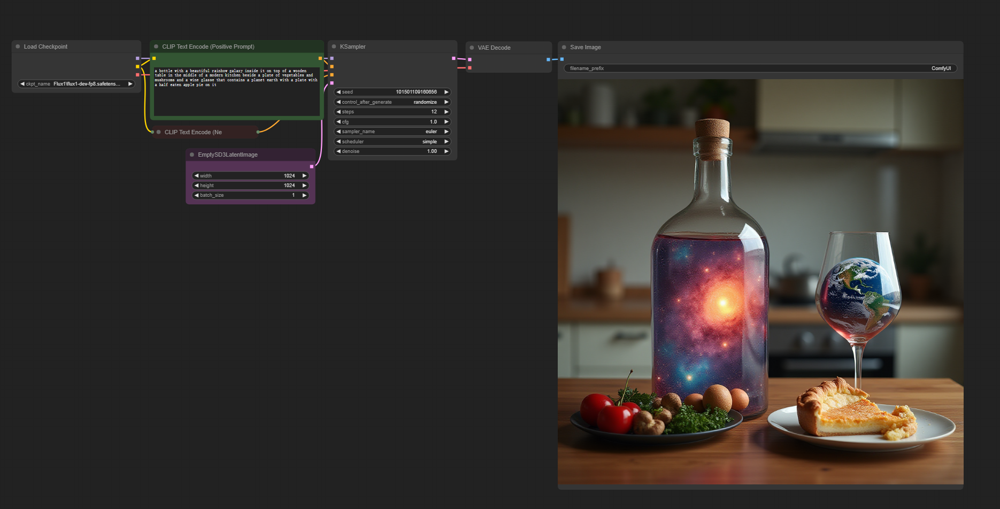

这里需要注意：

- 使用FLUX.1模型不需要填写反向提示词，将KSampler里的cfg调为1，忽略反向提示词
- 可以使用FluxGuidance这个节点来控制提示词权重

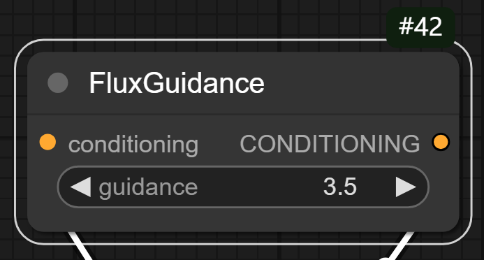

#### 2.4使用FLUX.1 dev fp8模型进行图生图

像前面一样，在上面的文生图工作流上进行一些小的改动，就可以将其转换为图生图工作流

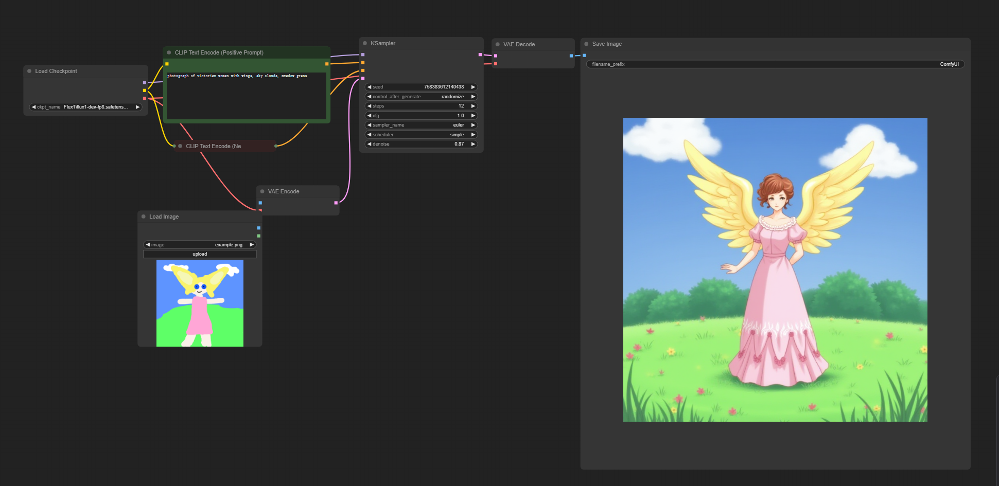

#### 2.5导入来自网络的工作流

在尝试了几个官方示例工作流后，我感觉意犹未尽😁。于是在[openart workflows](https://openart.ai/workflows/home)尝试了几个大佬制作的优秀工作流案例。

最常用的导入工作流的方法是：

1. 在上面的网站上，下载自己想要导入工作流的json文件。

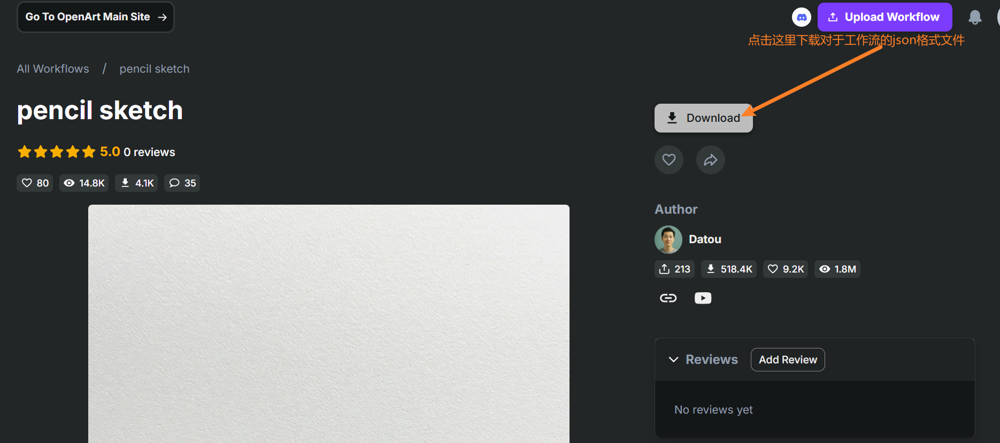

2. 在ComfyUI中选择从文件导入工作流，选择下载好的json文件即可成功导入

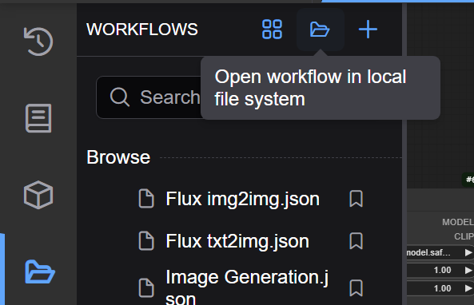

3. 导入后如果看到一大堆红色的节点，表示它们是缺失第三方自定义节点，可以通过ComfyUI Manager中的Install Missing Custom Nodes功能安装缺失的节点，如果没有安装ComfyUI Manager，可以在其GitHub仓库找到安装方法：[ltdrdata/ComfyUI-Manager](https://github.com/ltdrdata/ComfyUI-Manager)

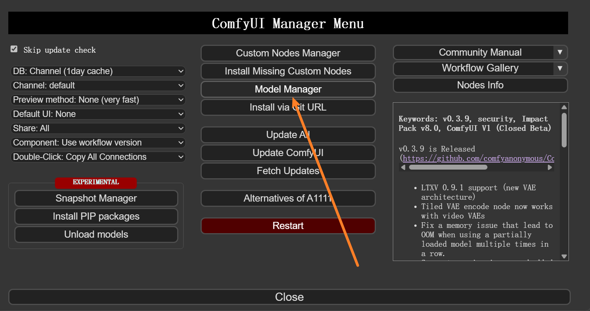

#### 2.6铅笔手绘手绘风格文生图工作流

这是这个工作流的地址：[pencil sketch](https://openart.ai/workflows/datou/pencil-sketch/jNotO6649m9OxqVzJeBx)

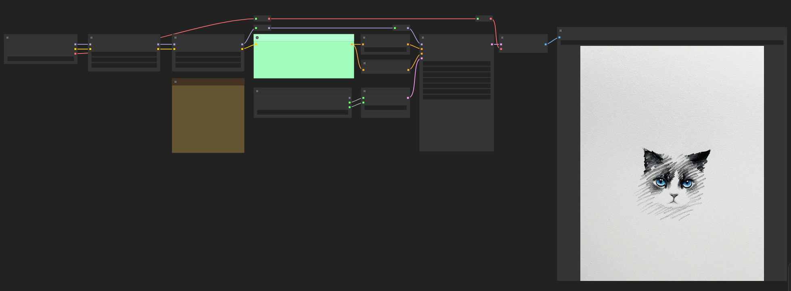

相较于官方的文生图示例，这个工作流增加了两个`Load Lora`节点来导入Lora模型，如果你不太清楚Lora的工作原理可以参考这篇文章：[LORA详解（史上最全）_lora模型-CSDN博客](https://blog.csdn.net/qq_41475067/article/details/138155486)

生成图片案例鉴赏：

### 3.使用ComfyUI API说明

### 4.Unity前端搭建说明

